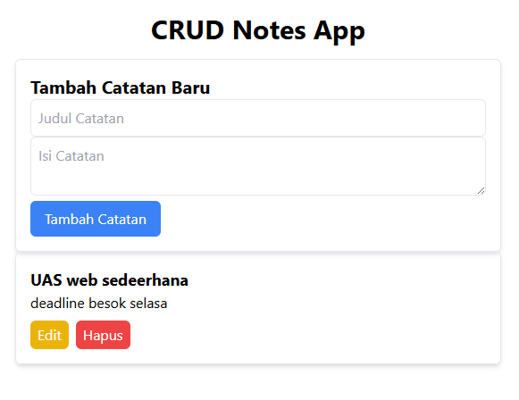

# CRUD Web App with react Tailwind CSS

### Disusun oleh:
**Nama**: ALFHIN CHORRYAGNESHA AZIZ  
**Instansi**: Universitas Pelti Bangsa

## 📚 1. Apa Itu CRUD?
CRUD adalah singkatan dari:

- **Create**: Menambahkan data baru.
- **Read**: Membaca atau melihat data yang sudah ada.
- **Update**: Memperbarui data yang sudah ada.
- **Delete**: Menghapus data.

Aplikasi CRUD sangat umum digunakan di dunia pemrograman, terutama pada aplikasi berbasis web.



## 🛠 2. Tools yang Digunakan
- **ReactJS**: Library JavaScript untuk membangun UI.
- **Tailwind CSS**: Framework CSS untuk styling yang cepat.
- **Node.js & npm**: Untuk mengelola proyek React dan dependencies.

## 📝 3. Langkah-Langkah Pembuatan CRUD App

### ✅ Langkah 1: Buat Proyek React
Buka terminal dan jalankan perintah berikut untuk membuat proyek React baru:

```bash
npx create-react-app my-crud-app
cd my-crud-app
```

### ✅ Langkah 2: Install Tailwind CSS
Masukkan perintah berikut untuk mengatur Tailwind CSS:

```bash
npm install -D tailwindcss postcss autoprefixer
npx tailwindcss init
```

Lalu, konfigurasi file `tailwind.config.js` agar Tailwind bisa digunakan di proyek React:

**Edit tailwind.config.js:**

```javascript
module.exports = {
  content: [
    './src/**/*.{js,jsx,ts,tsx}',
  ],
  theme: {
    extend: {},
  },
  plugins: [],
}
```

### ✅ Langkah 3: Siapkan CSS Tailwind
Buat file `src/index.css` dan tambahkan kode berikut:

```css
@tailwind base;
@tailwind components;
@tailwind utilities;
```

### ✅ Langkah 4: Struktur Proyek
Pastikan proyek Anda memiliki struktur seperti ini:

```bash
my-crud-app/
├── public/
├── src/
│   ├── components/
│   │   ├── CreateNote.js
│   │   ├── EditNote.js
│   │   └── NoteList.js
│   ├── App.js
│   ├── index.js
│   └── index.css
├── package.json
└── tailwind.config.js
```

## 📂 4. Buat Komponen CRUD

### 🖋 a. CreateNote.js (Form untuk Menambahkan Data Baru)
Buat file `CreateNote.js` di folder `components`:

```javascript
import { useState } from "react";

function CreateNote({ addNote }) {
  const [title, setTitle] = useState("");
  const [content, setContent] = useState("");

  const handleSubmit = (e) => {
    e.preventDefault();
    addNote({ title, content });
    setTitle("");
    setContent("");
  };

  return (
    <form className="p-4 border rounded-md shadow-md" onSubmit={handleSubmit}>
      <h2 className="text-xl font-bold">Tambah Catatan Baru</h2>
      <input
        type="text"
        value={title}
        onChange={(e) => setTitle(e.target.value)}
        placeholder="Judul Catatan"
        className="w-full p-2 border rounded-md"
        required
      />
      <textarea
        value={content}
        onChange={(e) => setContent(e.target.value)}
        placeholder="Isi Catatan"
        className="w-full p-2 border rounded-md"
        required
      />
      <button type="submit" className="px-4 py-2 bg-blue-500 text-white rounded-md">
        Tambah Catatan
      </button>
    </form>
  );
}

export default CreateNote;
```

...

## 📋 6. Kesimpulan
Tugas UAS membuat aplikasi CRUD sederhana menggunakan React dan Tailwind CSS. Silakan dulur-dulur lanjutkan dengan menambahkan fitur-fitur baru dan styling yang menarik.

